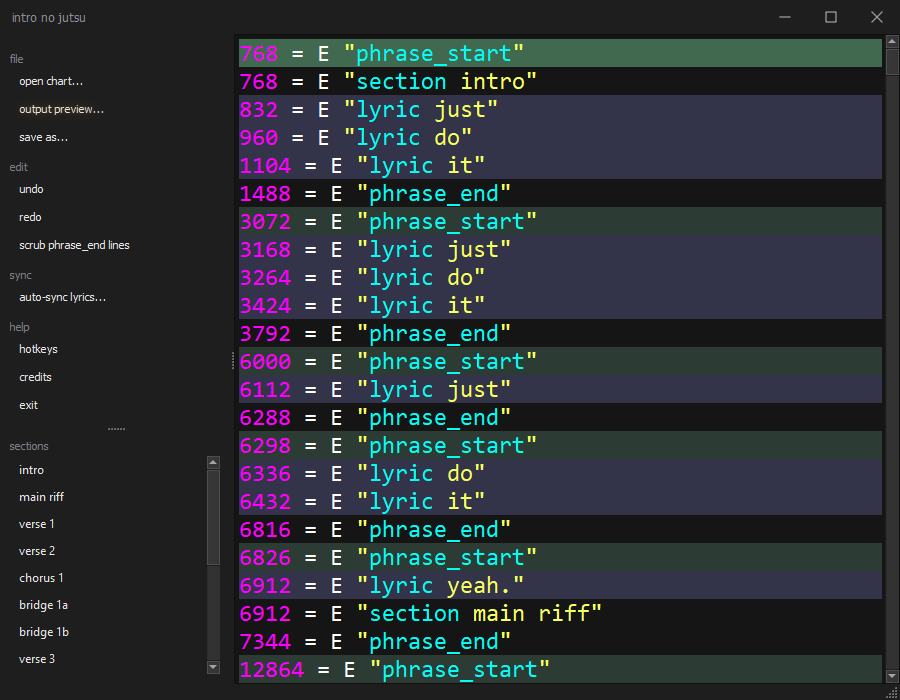
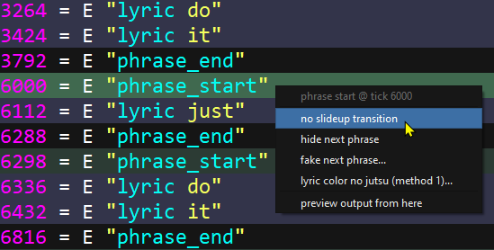
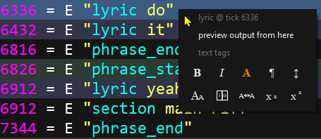
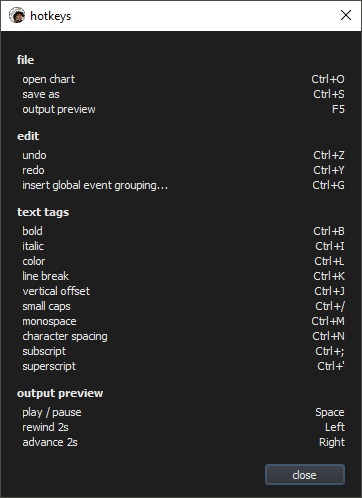
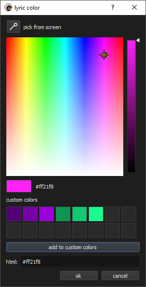
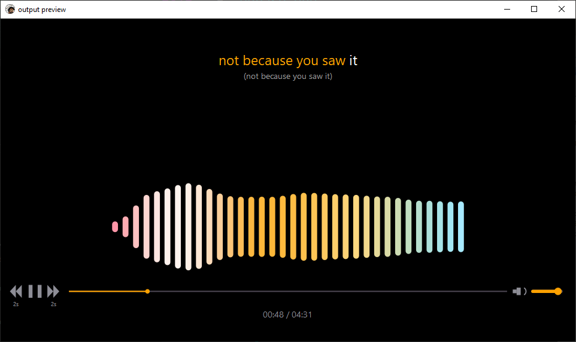
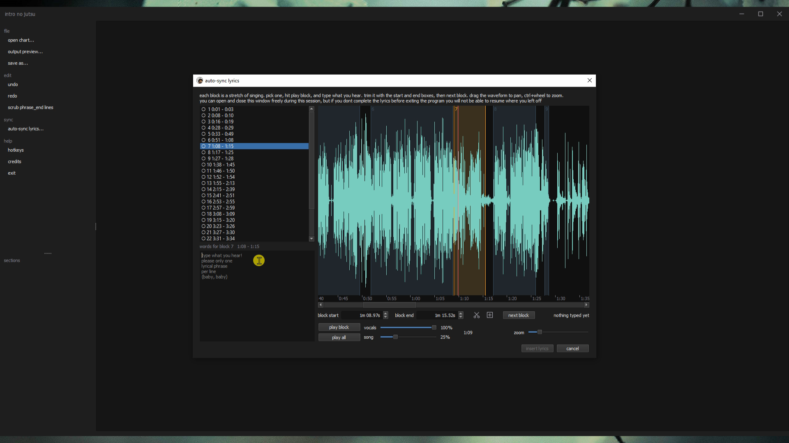
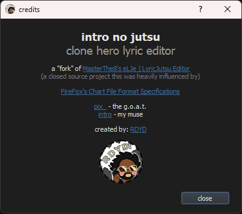

# intro no jutsu

clone hero lyric editor

a "fork" of [MasterThe8's eLJe | LyricJutsu Editor](https://masterthe8.github.io/eLJe-LyricJutsuEditor/), a closed source project this was heavily influenced by

made by [RDYD](https://www.enchor.us/?charter=rdyd)

---

## getting it

grab the zip from [releases](../../releases), unpack it anywhere, run `intro no jutsu.exe`.
windows only, no installer, nothing goes in the registry. `setting.ini` lives next to the exe
and is yours to edit

its unsigned, so smartscreen will probably want a "more info -> run anyway" the first time

or run it from source, see [building it](#building-it)

---

## what it does

edits the `[Events]` section of a `.chart` file. you open a chart, it strips out everything
except the events, you edit the lyrics, you save it back. the rest of the chart is held onto
untouched and stitched back in when you save. every other section comes back out byte for byte
in the order it went in, including tracks this thing has never heard of.

if you try to close with unsaved changes it asks first. if theres nothing to save it just closes.

the point of it is applying "jutsus." these are little tricks that fuckulate how clone hero displays
lyrics by default so you can do lil visual effects with them.



---

## the jutsus

right click any `phrase_start` line and you get these

| jutsu | what it does |
| --- | --- |
| no slideup transition | kills the slide up animation |
| hide next phrase | removes next line lyric preview |
| fake next phrase | shows a fake next line in lyric preview |
| lyric color no jutsu (method 1) | wraps the phrase in color tags. opens a picker |



lyric timing gets preserved. the scaffolding gets anchored backwards off the first lyric in
the phrase, the lyric itself never gets moved. lyric events are explicitly timed, phrase_start
lines are not, so the phrase_start is what moves.

all of them check the ticks they need are free first and refuse with a dialog instead of
overwriting something you already had there

---

## text tags

right click any `lyric` line for the tag buttons. bold, italic, color, line break, vertical
offset, small caps, monospace, character spacing, subscript, superscript.



tags wrap the whole lyric inside the quotes no matter where on the line you clicked

```
1968 = E "lyric al-"   ->   1968 = E "lyric <b>al-</b>"
```

you can rebind them in `setting.ini` under `[Shortcut]`



---

## color picker

dropper up top grabs a color from anywhere on screen. custom colors save to `setting.ini`
so theyre still there next time



if a lyric has two nested color tags the first one is the base color and the second is the
highlight while its sung. thats what lyric color no jutsu method 1 does. one tag on its own
just holds that color the whole way through

---

## output preview

`file -> output preview...` or `F5`. asks you what audio to sync to once and remembers it for
the session. right click any `phrase_start` or `lyric` line and pick "preview output from here"
to start from exactly that tick



it reads the tempo map out of `[SyncTrack]` so it stays in sync through tempo changes. tags get
rendered, so bold and small caps and colors all show up how theyd actually look

the visualiser is running off the actual audio, its a spectrum analyser with the sweep locked
to the songs bpm

### getting around

| what | how |
| --- | --- |
| play / pause | space, or the play button |
| scrub | click or drag anywhere on the playback bar |
| back 2 seconds | left arrow, or the `2s` button left of play |
| forward 2 seconds | right arrow, or the `2s` button right of play |
| volume | the slider on the right |

---

## auto-sync lyrics

`sync -> auto-sync lyrics...` in the nav pane. it pulls the vocals out of the
song, works out where the words go, and writes the `phrase_start` and `lyric` events

its word level only. splitting words into syllables is still on you, on purpose

**you dont need the lyrics up front.** it chops the song into blocks of singing and you type
into them as you listen. having them already just saves you the typing



### the main way: type as you go

pick the audio, leave the lyrics box empty, hit start.

1. it isolates the vocals and listens to them. few minutes, theres a progress bar and a cancel
   button and cancelling actually kills it
2. you get the **vocal** waveform, not the mix, chopped into the stretches where someone is
   actually singing. one box per block
3. click a block and the playhead jumps to it. hit play, type what you hear
4. insert

type one line per phrase in the box. a block usually holds two or three lines and the line
breaks you type are what splits it back up. blocks you leave empty get skipped, which is what
you want for the ad-libs and backing vocals it picks up

a block is **not** a phrase and dont expect it to be. youre still deciding where the lines
break, just while listening to that bit instead of placing [Event] flags.

### optional: paste them first

if youve already got the lyrics somewhere, paste them in, one line per phrase, word for word.
then theres nothing to type, and you get a window per **line** instead of per block, each one
already sat over its own words for you to check

### once youre on the waveform

the waveform is the **isolated vocal**, nothing else. what youre hearing is both tracks at
once, the vocal on top of the original at a quarter volume, so you can hear the words without
not completely in the dark. theres a slider for each

theyre mixed together into one stream rather than played as two files, so they cant drift
apart. even a few milliseconds would phase against each other and sound like hog shit

| what | how |
| --- | --- |
| pan | click and drag the waveform. drag right to wind back, left to go forward |
| zoom | ctrl+wheel, or the zoom slider |
| play the selected block | play block, or space. hit it again to hear it again |
| play the whole song | play all, which becomes stop while its running |
| adjust a block | the start and end boxes. wheel or arrows step 0.1s, hold shift for 0.01s |
| split a block | the scissors, or `s`. then click where you want the cut |
| add a block | the boxed +, or `n`. then click where you want it. one second long |
| move on | next block. selects the next one and plays it, ready to type |

### how good is it

tested against six hand-charted songs across six genres, 1742 words. half the words land
within 50ms, three quarters within 100ms, 93% within 250ms

so its a first draft, not a finished chart. expect to refine the windows a bit.

it refuses to run on a chart that already has lyric events. it only fills in an empty one

### what it writes

a `phrase_start` before the first word of each line and a `phrase_end` after the last, so every
line opens and closes. where the audio told us the line stops.

**heads up:** `phrase_end` fucks up most of the jutsus and isnt technically needed. the first
time you use a jutsu on a chart that has them, itll say so and offer to scrub them.

### the download

first run pulls about 244mb of models off huggingface and github and keeps them in
`%LOCALAPPDATA%\intro no jutsu\models`. not next to the exe.

- `wav2vec2-base-960h` fp16 - listens to the vocals
- `UVR-MDX-NET-Voc_FT` - pulls the vocals out of the mix

it wont try to transcribe the words for you either. it can, but it gets 79% of them wrong on
these songs, so a prefilled box would be worse than an empty one

---

## jumping around by section

the bottom half of the nav pane lists every `section` event in the chart. click one and it
takes you straight there. the line lands at the top of the editor.

the list fills itself in when you load a chart and keeps up while you edit, so renaming a
section or adding a new one shows up on its own

---

## building it

you need python 3.11. it was built on 3.11.9

```bash
pip install -r requirements.txt
```

that pulls in the auto-sync half too (numpy, onnxruntime, pyav). if you only want the editor,
`pip install pyqt5 chardet` is enough to run it from source - auto-sync is the only thing that
needs the rest

run it from source

```bash
python main.py
```

build the exe

```bash
pyinstaller intro-no-jutsu.spec
```

### notes on the build

the spec builds **two** exes. `intro no jutsu.exe` is the one you run and the only thing at
the top level; `inj-worker.exe` sits inside `_internal` with the rest of the machinery so
theres nothing to click on by mistake. the worker is the auto-sync pipeline and it has no
pyqt5 in it at all, on purpose - qt
loaded before onnxruntime breaks onnxruntime's dll init, and you cant dodge that with an argv
check because pyinstaller's own pyqt5 runtime hook imports QtCore before your entry script even
starts. so it has to be a genuinely separate exe with a separate analysis

the spec does a lot of pruning. the app half of it is about 55mb. the whole folder is about
192mb once numpy, onnxruntime and pyav go in for the worker. those only go into the worker's
excludes, never the app's

a few things in there **cannot** be removed and theyre commented in the spec so nobody rips
them out later

- `zipfile` and `logging` - pyinstaller's own runtime hook imports them, the exe wont start without them
- `Qt5Network.dll` and `PyQt5.QtNetwork` - QtMultimedia links against them and the preview needs QtMultimedia
- `decimal` in the worker - pyav imports `fractions` and `fractions` imports `decimal`
- `libcrypto-3.dll` in the worker - `_ssl.pyd` links against it and the worker downloads over https

`audioop` mixes the two audio tracks and is built into the interpreter on 3.11, so it ships
without a hook. its gone in python 3.13, so that pins the ceiling for now

if you widen the excludes, build with `console=True` first. a windowed build swallows import
errors and just dies silently

`from data import img` in main.py looks like an unused import. it isnt. it registers the whole
`:/img` resource tree and every icon in the app dies without it. thats what the `# noqa` is for

---

## file layout

```
main.py                 the whole ui
worker_entry.py         entry point for the second exe
intro-no-jutsu.spec     pyinstaller config (see build notes)
setting.ini             colors, font, hotkeys, custom colors
rdyd.ico / rdyd.png     app icon
questionmark.opus       the sound the ? button on credits plays
data/
  timing.py             tick -> seconds, tempo map, phrase and tag parsing
  preview.py            the output preview window
  waveform.py           the vocal waveform. pans and draws, doesnt edit
  mixplayer.py          plays the song and the vocal stem as one stream
  syncrunner.py         drives the auto-sync worker process
  spectrum.py           fft and octave banding for the visualiser
  colorpicker.py        the color picker
  Highlighter.py        syntax highlighting
  LCJutsu.py            lyric color no jutsu method 1
  theme.py              light/dark detection
  sfx.py                ui click and the credits sound
  paths.py              where settings and bundled files live
  img.py                generated qt resource blob, dont hand edit
worker/                 runs in the worker process. never import qt in here
  pipeline.py           the auto-sync jobs: prepare, prefill, blocks, align
  mdx.py                vocal separation
  w2v2.py               ctc emissions and forced alignment
  audio.py              decoding and waveform peaks
  models.py             model manifest and where they live
  download.py           first run model fetch
  protocol.py           the json-lines wire format
  run.py                worker entry point
```

---

## license

gpl v3. see [LICENSE](LICENSE)

Copyright (C) 2026 RDYD

---

## credits

original by [MasterThe8](https://masterthe8.github.io/eLJe-LyricJutsuEditor/)

chart format reference - [FireFox's Chart File Format Specifications](https://docs.google.com/document/d/1v2v0U-9HQ5qHeccpExDOLJ5CMPZZ3QytPmAG5WF0Kzs/edit?tab=t.0#heading=h.db6ovgw5uat6)

[pix_](https://www.enchor.us/?charter=pix_) - the g.o.a.t.

[intro](https://www.enchor.us/?charter=intro) - my muse

### built with

none of this would exist without these, so:

- [PyQt5](https://www.riverbankcomputing.com/software/pyqt/) - the entire ui, and
  [Qt](https://www.qt.io/) underneath it
- [chardet](https://github.com/chardet/chardet) - works out what encoding a `.chart` was saved in
- [NumPy](https://numpy.org/) - every bit of the audio maths
- [ONNX Runtime](https://onnxruntime.ai/) - runs both models on the cpu, no torch anywhere
- [PyAV](https://github.com/PyAV-Org/PyAV) - decodes the audio, which means
  [FFmpeg](https://ffmpeg.org/) is doing the actual work
- [PyInstaller](https://pyinstaller.org/) - turns it into the two exes

### the models auto-sync downloads

- **wav2vec2-base-960h** - reads the words. by meta ai, from
  [wav2vec 2.0](https://arxiv.org/abs/2006.11477) (baevski et al., 2020),
  [model card](https://huggingface.co/facebook/wav2vec2-base-960h), apache-2.0. the onnx build
  it actually fetches is [Xenova's](https://huggingface.co/Xenova/wav2vec2-base-960h)
- **UVR-MDX-NET-Voc_FT** - pulls the vocals out. from
  [Ultimate Vocal Remover](https://github.com/Anjok07/ultimatevocalremovergui) by anjok07 and
  aufr33, built on [MDX-Net](https://github.com/kuielab/mdx-net) by kuielab. 


